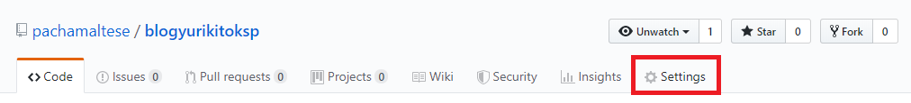
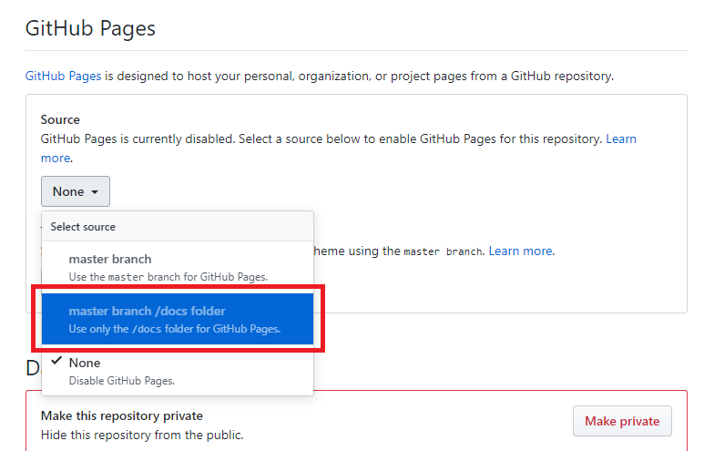

# blog

El tema está adaptado a partir del blog pacha.hk de @pachamaltese

## ¿Cómo se usa?

Asumiendo que el paquete `blogdown` está instalado (e.g. `install.packages("blogdown")`), hay que ir dejando los nuevos posteos en `content/post`.

Para ir actualizando el blog bastará con abrir `blog.Rproj` desde RStudio y ejecutar `blogdown::serve_site()`, lo que generará el blog en `docs/` e irá actualizando cada vez que guardes cambios, a menos que reinicies la sesión de R.

## Post de ejemplo

Se incluye un post de ejemplo, `demo/2017-03-20-anova-part-1.Rmd`, que contiene ecuaciones enumeradas, código R y la configuración de RMarkdown. El resultado está disponible [acá](http://pacha.hk/blog/2017/03/20/linear-regression-and-anova-shaken-and-stirred-part-1/).

## Crea tus propios post

Se puede adaptar dicho ejemplo cambiando, además del contenido, los siguientes campos:

* title
* author
* date
* categories
* tags
* cache.path

Recuerda siempre dejar las fechas en formato yyyy-mm-aa. Los archivos que vayas generando deben llevar un nombre de la forma `yyyy-mm-dd-nombre-corto.Rmd`.

## Configuración de github

Para que el blog esté disponible en `miusuario.github.io./blog` debes habilitar gh-pages desde `docs/`

